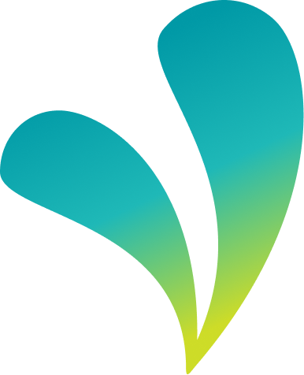

<p align="center">
  
</p>

<h1 align="center">VISENSA</h1>

<p align="center">
  <strong>Vision-Based Digital Neurorehabilitation Platform for Interactive Mirror Therapy</strong>
</p>

<p align="center">
  
  
  
  
  
</p>

---

## 📖 Overview

**VISENSA** is a web-based digital neurorehabilitation platform that adapts the principles of Mirror Box Therapy into an interactive three-dimensional (3D) environment. Designed as an assistive rehabilitation tool, Visensa aims to help reduce Phantom Limb Pain (PLP) in post-amputation patients while supporting motor recovery for stroke patients with hemiparesis. By leveraging markerless AI hand tracking (MediaPipe), real-time 3D visualization, and a robotic prosthetic arm model, Visensa enables users to perform interactive mirror therapy directly through a web browser without requiring additional hardware beyond a standard webcam.

### Key Highlights
- 🤖 **AI Hand Tracking** — MediaPipe detects 21 hand landmarks at 30 FPS directly in the browser.
- 🦾 **3D Prosthetic Arm** — Real-time mirroring of hand movements onto a rigged 3D robotic arm model using React Three Fiber.
- 🧠 **Kinematics Engine** — Kalidokit translates 2D/3D landmark coordinates into accurate bone rotations (Euler/Quaternion).
- 🎨 **Premium UI/UX** — Glassmorphism design, GSAP scroll animations, Lenis smooth scrolling, and Space Grotesk typography.
- 🔒 **Privacy-First** — All AI processing runs locally on the user's device. No video is sent to any server.

---

## 🛠️ Tech Stack

| Category | Technology | Purpose |
| :--- | :--- | :--- |
| **Framework** | React 19 + Vite 8 | Core SPA framework with lightning-fast HMR |
| **3D Engine** | React Three Fiber + Three.js | WebGL rendering for the 3D prosthetic model |
| **AI / Vision** | MediaPipe Tasks-Vision | Real-time hand landmark detection |
| **Kinematics** | Kalidokit | MediaPipe → bone rotation conversion |
| **State** | Zustand | Lightweight global state for tracking data |
| **Animation** | GSAP + Lenis | Scroll-triggered animations & smooth scrolling |
| **Routing** | React Router DOM v7 | Client-side page navigation |
| **Backend** | Express | REST API, authentication, and database communication |
| **Deployment** | Vercel | Automated CI/CD from GitHub |

---

## 📂 Project Structure

```
src/
├── assets/              # Static images, SVGs, icons
├── components/          # Reusable UI components
│   ├── reactbits/       # Animation components (TextType, SpotlightCard)
│   ├── sections/        # Landing page sections (Hero, Features, Testimonial)
│   ├── ui/              # Small UI elements (Navbar, Preloader, Footer)
│   ├── VisensaCanvas.jsx  # R3F canvas for 3D model rendering
│   └── VisionTracker.jsx  # MediaPipe camera + AI pipeline
├── hooks/               # Custom React Hooks
│   ├── useGsapAnimations.js  # GSAP ScrollTrigger logic
│   ├── useHeroAnimation.js   # Hero section animation sequence
│   ├── useExerciseTracker.js # Exercise progress tracking
│   └── useLenis.js           # Smooth scrolling initialization
├── models/              # GLTF/GLB → React components (3D arm model)
├── pages/               # Page-level components (routes)
│   ├── admin-dashboard/ # Analytics & management dashboard
│   ├── camera/          # Active rehabilitation session UI
│   ├── intro/           # Pre-session camera preview
│   ├── login/           # User & Doctor authentication
│   ├── register/        # User & Doctor registration
│   └── session-complete/ # Post-session summary
├── services/            # External integrations
│   ├── kalidokit/       # Kalidokit rotation bridge
│   └── mediapipe/       # MediaPipe Hand Landmarker setup
├── store/zustand/       # Global state management
├── styles/              # Modular CSS files
├── App.jsx              # Root routing & global hooks
└── index.css            # Global styles & CSS variables
```

---

## 🚀 Getting Started

### Prerequisites
- **Node.js** v18 or higher
- **npm** v9 or higher
- A device with a **webcam**

### Installation

```bash
# 1. Clone the repository
git clone https://github.com/Arfzz/Visensa.git
cd Visensa

# 2. Install dependencies
npm install

# 3. Start development server
npm run dev
```

The app will be available at `http://localhost:5173`.

---

## 🔑 Demo Access

For demonstration purposes, the authentication flow is currently mocked.

> **No username or password is required.**
>
> Simply click the **Login** button on either the Patient or Doctor login page to access the application.

**Available Demo Flows**
- 👤 **Patient** → Click **Login** on `/login`
- 👨‍⚕️ **Doctor** → Click **Login** on `/login-doctor`

Authentication and backend integration will be connected to the Express.js API in future development.

---

### Available Scripts

| Command | Description |
| :--- | :--- |
| `npm run dev` | Start development server with HMR |
| `npm run build` | Build for production (output to `dist/`) |
| `npm run preview` | Preview the production build locally |
| `npm run lint` | Run ESLint to check code quality |

---

## 🔄 AI Tracking Pipeline

The core of Visensa is the real-time synchronization between the physical webcam and the virtual 3D model:

```
┌──────────┐    ┌──────────────────┐    ┌─────────────────┐
│  Webcam  │───▶│ VisionTracker.jsx│───▶│ MediaPipe Hand  │
│  Feed    │    │ (Frame capture)  │    │ Landmarker (AI) │
└──────────┘    └──────────────────┘    └────────┬────────┘
                                                 │
                                    Extract 21 3D landmarks
                                                 │
                                                 ▼
┌──────────────────┐    ┌──────────────────┐    ┌─────────────┐
│ VisensaCanvas.jsx│◀───│ Kalidokit Solver │◀───│ Zustand     │
│ (R3F 3D Render)  │    │ (Bone Rotations) │    │ VisionStore │
└──────────────────┘    └──────────────────┘    └─────────────┘
```

1. **VisionTracker** captures webcam frames and processes them through MediaPipe.
2. Extracted hand landmarks are stored in **Zustand** (`VisionStore`).
3. **Kalidokit** reads the store and computes inverse kinematics (bone rotations).
4. **VisensaCanvas** applies rotations to the 3D prosthetic arm model at 30 FPS.

---

## 📄 Available Routes

| Route | Description |
| :--- | :--- |
| `/` | Landing page with hero, features, and testimonials |
| `/login` | Patient login |
| `/register` | Patient registration |
| `/login-doctor` | Doctor/therapist login |
| `/register-doctor` | Doctor/therapist registration |
| `/intro` | Pre-session camera preview & exercise selection |
| `/camera` | Active rehabilitation session with 3D tracking |
| `/session-complete` | Post-session results summary |
| `/admin-dashboard` | Doctor analytics dashboard |

---

## 🌐 Deployment

This project is deployed on **Vercel** with automatic CI/CD. Every push to the `main` branch triggers an automatic rebuild and deployment.

The `vercel.json` configuration handles SPA routing rewrites to prevent 404 errors on direct URL access.

---

### Branch Strategy
- **`main`** — Production-ready code (auto-deployed to Vercel).
- **`develop`** — Active development branch. All PRs target this branch first.

---

## 🙏 Acknowledgements

This project uses the following third-party assets:

### 3D Model
- **Robotic Prosthetic Arm**
- Source: https://sketchfab.com/3d-models/robotic-prosthetic-arm-43b482c8526f45709b56434924dc4d3c
- Platform: Sketchfab
- License: CC Attribution (CC BY 4.0)

We sincerely thank the original creator for making this asset available.

---

## 📜 Code Ownership

This project was independently developed by Team tahu cabe garam for the Software Development Competition.

All source code in this repository is the original work of the team unless otherwise stated. Third-party libraries, frameworks, and assets are used under their respective licenses and are acknowledged in the Acknowledgements section.

This repository is provided solely for competition evaluation and academic purposes.

---

<p align="center">
  <strong>Made with 💜 by Team tahu cabe garam © 2026</strong>
</p>

